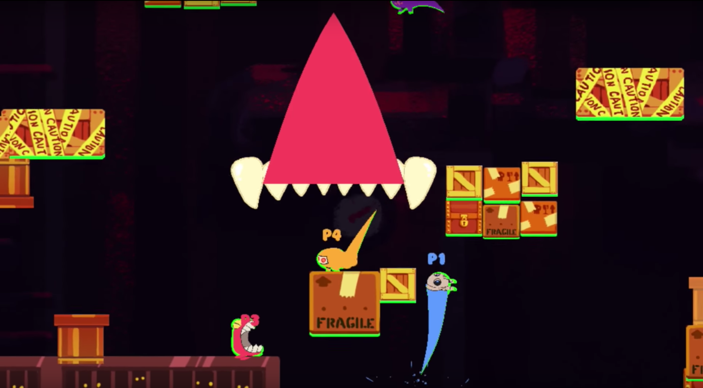

# 

## Factsheet

**Developer:**  
[Syndicate Atomic](https://ectoplaza.github.io/testrepo)  
Based in Los Angeles, CA

**Founding date:**  
October, 2015

**Website:**  
[ectoplaza.com][homepage]

**Press / Business contact:**  
[mike@syndicateatomic.com][contact]

**Social:**  
[twitter.com/ectoplaza][twitter]  
[facebook.com/ectoplaza][facebook]  

## Description

Ectoplaza will be apparating onto the North American Wii U eShop October 27th (Europe to follow soon)!

Ectoplaza is a breakneck game about irritable ghosts wreaking havoc on haunted hotels, paranormal guests, and each other.

Join a party of poltergeists as they rampage through underworld-renowned resorts from which they can never escape. Monster mash with up to four players and have the time of your afterlife.

### Features

* Choose from six unhappy haunts, each with their own stats and game-changing special abilities.
* Master a multi-tiered charge & fling system to unleash quick chomps, trick shots, and devastating ricochets.
* Smash your way through 5 settings and 15 different levels, each with different stage hazards.
* Be the last ghost standing in Afterlives, collect the most ectoplasm in Collectoplaza, or score the winning goal in Ghostball.

### History

EctoPlaza was originally pitched and accepted into the 2015 Dare to be Digital game-making competition held by Abertay University. EctoPlaza won ProtoPlay's Audience Choice Award, was subsequently picked as an "Official Select" for IndieCade 2015, and was featured at Tokyo Game Show 2016's Indie Games Area. EctoPlaza will be the debut game for Syndicate Atomic.

## Videos

Ectoplaza Release Date Trailer

<iframe width="420" height="315" src="https://www.youtube.com/embed/kWE0Zt_HmEk" frameborder="0" allowfullscreen></iframe>

Nintendo Spring Partner Preview

<iframe width="560" height="315" src="https://www.youtube.com/embed/2PtNr2U6cA0" frameborder="0" allowfullscreen></iframe>

## Images

download all screenshots as ** [.zip (26.2 MB)](assets/images/images.zip "Images zip") **

## Logo & Icon

download logo files as ** [.zip (668 KB)]( assets/images/logo.zip "Logo & Icon zip") **

## Awards & Recognition

> * "Dare To Be Digital Audience Choice Award" - *2015*
> * "IndieCade Official Select" - *2015*

## Contact

**Inquiries**  
[mike@syndicateatomic.com][contact]

**Twitter**  
[twitter.com/ectoplaza][twitter]

**Facebook**  
[facebook.com/ectoplaza][facebook]

<!--- =====================================================================  -->
<!--- Referenced links -->

[homepage]: http://ectoplaza.com "EctoPlaza"

[contact]: mailto:mike@syndicateatomic.com

<!--- Social -->

[twitter]: https://twitter.com/ectoplaza
[facebook]: https://facebook.com/ectoplaza
